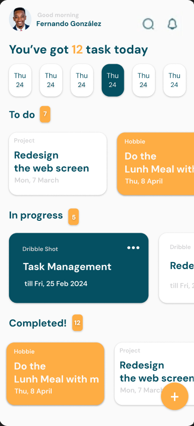
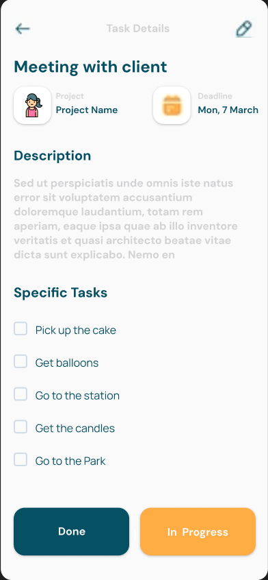
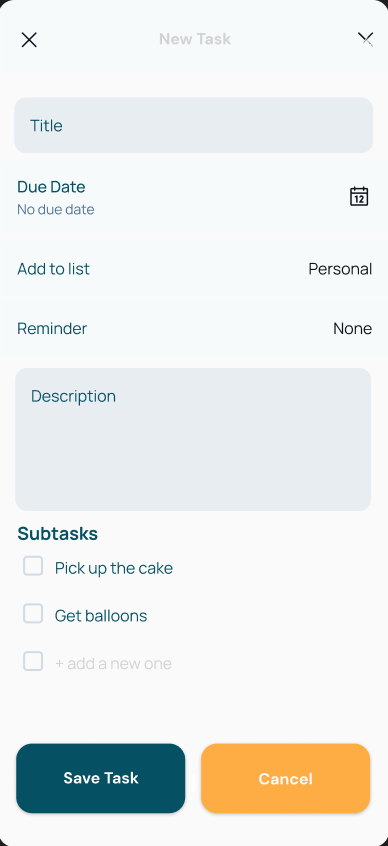

# 🎯 **TaskFlow**

TaskFlow is a mobile application designed to help you efficiently organize your tasks and subtasks. You can add main tasks, manage subtasks, and mark your tasks as completed—all with a clean and minimalist interface.

---

## 🚀 **Features**

- 📋 **Subtask Management**: Add, delete, and mark subtasks as completed.
- ➕ **Add New Tasks**: Tap on `+ add a new one` to add new subtasks to your list.
- 🎨 **Intuitive Design**: A simple and easy-to-use interface with smooth animations.
- 🌙 **Light and Dark Mode Support**: Perfect for any time of day.
- ✨ **List Customization**: Create specific lists such as "Personal", "Work", or "Others".

---

## 📸 **Screenshots**

<div align="center">

### Home Screen


### Task Details Screen


### New Task Screen


</div>
---

## 📲 **Installation**

1. Clone this repository:

   ```bash
   git clone https://github.com/your-username/diary-app.git
   ```
2. Open the project in Android Studio.
3. Ensure you have installed the dependencies for Jetpack Compose and Material Design 3.
4. Build and run the project on your emulator or physical device.

---

## 🛠️ **Technologies Used**

- **Kotlin**: Main programming language for development (v2.0.0).
- **Jetpack Compose**: Modern framework for building user interfaces declaratively, including tools like Activity Compose and Lifecycle ViewModel Compose.
- **Material Design 3**: Ensures a uniform and modern user experience through consistent visual components.
- **Android Gradle Plugin (AGP)**: Essential tool for compiling and packaging the application (v8.8.0).
- **Coil Compose**: Library for efficiently loading images in Compose applications (v2.6.0).
- **Hilt**: Dependency injection framework that simplifies instance management throughout the app (v2.51.1).
- **Kotlin Coroutines**: Asynchronous and concurrent handling for background operations (v1.7.3).
- **Kotlinx Serialization**: Provides serialization and deserialization of data, facilitating JSON handling (v1.6.3).
- **AndroidX Core KTX and Lifecycle Runtime KTX**: Extension libraries that simplify Android development (v1.10.1 and v2.8.7, respectively).
- **Navigation Compose**: Declarative navigation management between screens (v2.8.5).

---

## 📧 **Contact**

- **Creator**: Fernando González Laso
- **Email**: fernangl08@gmail.com
